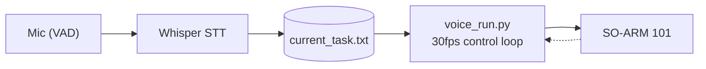

# Speech-Driven-VLA-Robotics

Voice-controlled manipulation on a low-cost **SO-ARM 101** arm, driven by **SmolVLA** vision-language-action policies.

Say a color out loud — the matching policy takes over the arm. Say "stop" and it eases back to home; say "complete" and the runner exits. Two policies stay resident in VRAM, so switching costs nothing at runtime.

```
"grab the red ball and put it in the box"   →  red ball model drives the arm
"grab the black ball and put it in the box" →  black ball model drives the arm
"stop"       →  ease back to home and hold
"complete"   →  shut down
```

---

## Architecture

Two independent processes coupled through one file. Speech recognition latency never blocks the 30fps control loop.



| Process | Role |
|---|---|
| `voice_task.py` | Listens, transcribes with Whisper, writes the parsed command to `current_task.txt` |
| `voice_run.py` | Reads that file every frame, selects the policy, runs SmolVLA inference, drives the arm |

---

## Documentation

| Document | Contents |
|---|---|
| [SmolVla.md](./SmolVla.md) | SmolVLA background — core concepts, architecture, training methodology |
| [VoiceRun.md](./VoiceRun.md) | The voice runner — state machine, per-frame algorithm, code walkthrough, key algorithms |

---

## Quick Start

```bash
# Terminal A — listener
python voice_task.py

# Terminal B — runner
python voice_run.py \
  --robot.type=so101_follower --robot.port=COM3 \
  --red_path=<path-to-red-checkpoint> \
  --rename_map='{"observation.images.front": "observation.images.camera1",
                 "observation.images.top":   "observation.images.camera2"}'
```

Add `--black_path=...` once the black model is trained — no code changes required.

Full flags and options: [VoiceRun.md § 8](./VoiceRun.md#8-running-it)

---

## Stack

| Component | Choice |
|---|---|
| Arm | SO-ARM 101 follower, 6-DOF |
| Policy | SmolVLA (`SmolVLM2-500M-Video-Instruct` backbone), chunk size 50 |
| Framework | [huggingface/lerobot](https://github.com/huggingface/lerobot) |
| Speech | Whisper `small`, CUDA, VAD-gated |
| Control rate | 30 fps |

---

## Status

- ✅ Runner passes `py_compile` and full module import
- ✅ Red ball model trained 
- ⚠️ Black ball model not yet trained — the "black" command safely holds at home
- ⚠️ Real hardware operation not yet verified
