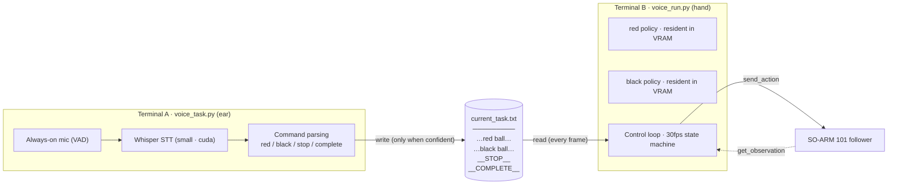
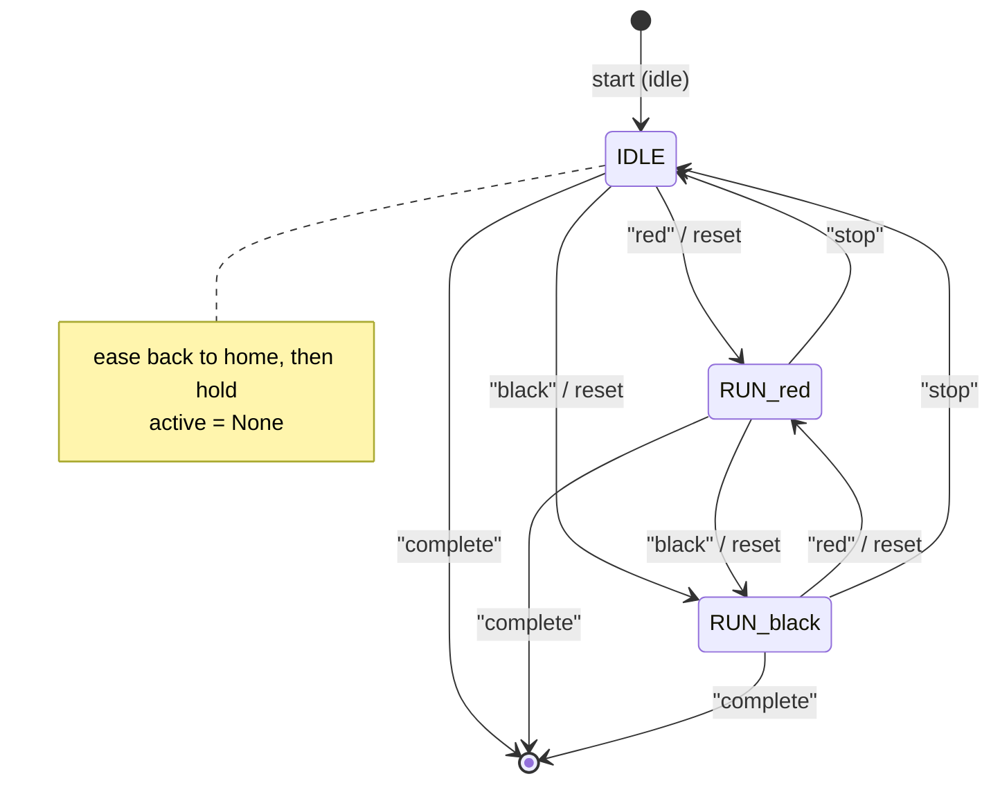
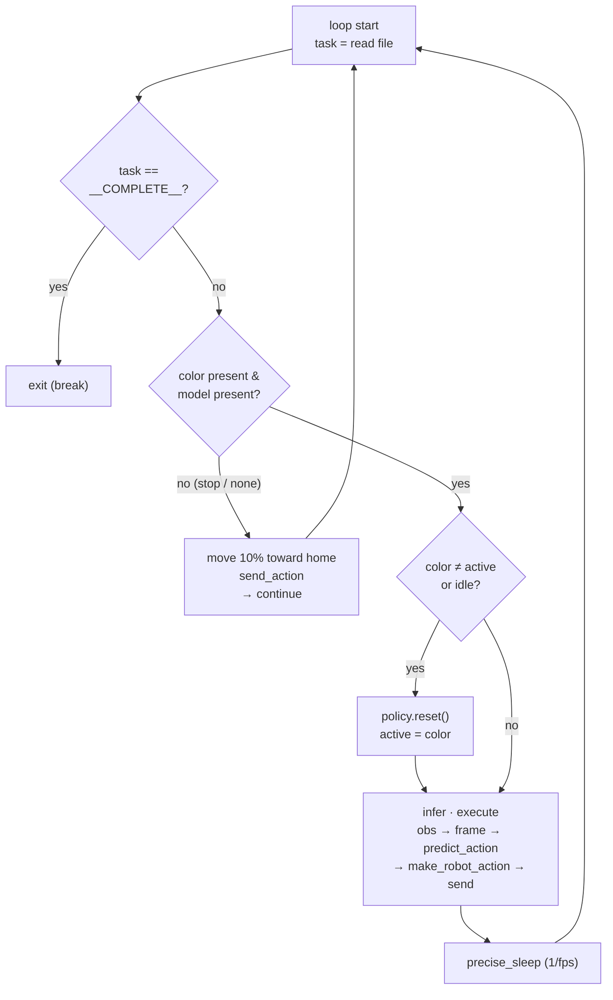
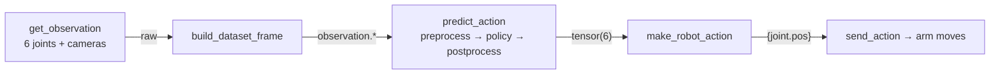

# Voice-Driven Two-Model Runner: `voice_run.py`

> Implementation notes for the SO-ARM 101 project — how a spoken color selects a SmolVLA policy, drives the arm, and handles stop / resume / exit

**Companion document:** [SmolVla.md](./SmolVla.md) (model background) · **Base framework:** [huggingface/lerobot](https://github.com/huggingface/lerobot)
**Policy:** SmolVLA · `chunk_size=50` · 6-DOF action
**Last updated:** 2026-08-12

---

## Table of Contents

1. [System at a Glance](#1-system-at-a-glance)
2. [Why a Custom Runner](#2-why-a-custom-runner)
3. [State Machine: Run · Stop · Switch](#3-state-machine-run--stop--switch)
4. [The Per-Frame Algorithm](#4-the-per-frame-algorithm)
5. [Inference Data Pipeline](#5-inference-data-pipeline)
6. [Code Walkthrough](#6-code-walkthrough)
7. [Three Key Algorithms](#7-three-key-algorithms)
8. [Running It](#8-running-it)
9. [Verification Status](#9-verification-status)

---

## 1. System at a Glance

The system is **two independent processes** loosely coupled through **a single file**. One side (the "ear") listens to speech and writes a command to the file; the other side (the "hand") reads that file every frame and controls the robot. Because they never call each other directly, a slow speech-recognition pass never stalls the control loop — the robot keeps running at its own fixed rate.



| Element | Responsibility |
|---|---|
| `voice_task.py` | VAD → Whisper STT → intent parsing → atomic write of `current_task.txt` |
| `current_task.txt` | The only interface between the two processes; holds a task string or a sentinel |
| `voice_run.py` | Loads both policies, runs the 30fps control loop, sends actions to the arm |
| Sentinels | `__STOP__` (ease to home and hold) · `__COMPLETE__` (exit the loop) |

> `voice_task.py` overwrites the file (atomic replace) only when a command is unambiguous. `voice_run.py` reads it every frame, sends position commands to the robot, and reads observations back.

---

## 2. Why a Custom Runner

`lerobot-record` cannot serve this demo as-is, for three reasons.

| Limitation of `lerobot-record` | Consequence | How the runner solves it |
|---|---|---|
| Accepts a single `--policy.path` | Cannot switch between per-color models | Holds a `{color: (policy, pre, post)}` dictionary, all resident in VRAM |
| Writes a dataset frame every step | Unnecessary for a live demo; memory grows over long runs | Pure inference loop — no dataset, no frame buffer |
| Ends on an episode timer | Demo must stay alive until told to stop | Runs until `__COMPLETE__` appears in the task file |

> **Core principle:** the loop structure is written from scratch, but the *inference* path reuses the exact components `record` uses — `build_dataset_frame`, `predict_action`, `make_robot_action`. Each model therefore behaves identically to a normal `record` run; only switching, stopping, and continuous execution are ours.

---

## 3. State Machine: Run · Stop · Switch

The runner's entire behavior is a **state machine** over two variables: `active` (the color currently running) and `idle` (whether it is holding in a stopped state). Voice commands drive the transitions.



| Command | From | To | Side effect |
|---|---|---|---|
| `red` / `black` | IDLE or the other RUN state | RUN_\<color\> | `policy.reset()` + `pre.reset()` + `post.reset()` |
| `stop` | any RUN state | IDLE | `active = None`, exponential easing to home |
| `complete` | any state | EXIT | `break` out of the loop |

A color command **always** carries a reset — for red↔black switches and for resuming from IDLE alike. Section 7B explains why.

---

## 4. The Per-Frame Algorithm

The control loop repeats forever at 30fps, reading the task file every frame and branching **four ways**. The order of those checks is the algorithm: *exit → stop/idle → switch → run*.



> The stop/idle branch skips inference with `continue` and goes straight to the next frame. The switch branch calls `reset` and then falls through into the inference block. A color whose checkpoint was not supplied (e.g. `black` before it is trained) takes the stop/idle branch — the arm safely holds at home instead of erroring.

---

## 5. Inference Data Pipeline

Inside the run branch, this is the chain a single frame follows from robot → policy → robot. Every component is the same one `lerobot-record` uses, which is why the inference result matches a normal record run even with no dataset present.



| Stage | Detail |
|---|---|
| Observation | `observation.state` (6) + `observation.images.front` / `.top` |
| Rename | `front → camera1`, `top → camera2` (`rename_observations_processor`) |
| Tokenize | `SmolVLM2-500M-Video-Instruct` tokenizer, `max_length=48`, task string as prompt |
| Normalize | Mean/std statistics loaded from the checkpoint |
| Policy | SmolVLA, `chunk_size=50`, `n_action_steps=50`, `use_amp=true` |
| Unnormalize | Postprocessor → `tensor(6)` |

> Normalization statistics ship inside the checkpoint folder, so accurate inference works **without the original training dataset** being present on disk.

---

## 6. Code Walkthrough

### 6.1 Config — CLI arguments identical to `record`

Declaring `robot: RobotConfig` inside the `@dataclass` lets draccus parse `--robot.type`, `--robot.port`, `--robot.cameras`, and the rest exactly as `lerobot-record` does. Model paths are supplied one per color.

```python
@dataclass
class VoiceRunConfig:
    robot: RobotConfig              # draccus parses --robot.*
    red_path: str
    black_path: str | None = None   # optional if black is not trained yet
    task_file: str = ".../current_task.txt"
    fps: int = 30
    device: str = "cuda"
    rename_map: dict[str, str] = field(default_factory=dict)
```

### 6.2 Model loading — self-contained checkpoints

Each checkpoint folder holds the weights *and* the normalization statistics, so it loads without a dataset. For each color we build a **triple of (policy, preprocessor, postprocessor)** and keep it in a dictionary; both stay resident in VRAM so a switch costs nothing at runtime.

```python
def _load_model(path, cfg):
    policy = SmolVLAPolicy.from_pretrained(path)
    policy.to(cfg.device); policy.eval()
    pre, post = make_pre_post_processors(
        policy_cfg=policy.config,
        pretrained_path=path,
        preprocessor_overrides={
            "device_processor": {"device": cfg.device},
            "rename_observations_processor": {"rename_map": cfg.rename_map},
        },
    )
    return policy, pre, post

models = {"red": _load_model(cfg.red_path, cfg)}
if cfg.black_path:
    models["black"] = _load_model(cfg.black_path, cfg)
```

### 6.3 Main loop — the four-way branch

```python
while True:
    t0 = time.perf_counter()
    task = _read_task(cfg.task_file)

    # (1) full shutdown
    if task == COMPLETE_TASK:
        break

    color = _color_of(task) if task and task != STOP_TASK else None

    # (2) stop / idle / color with no checkpoint -> ease toward home, then continue
    if color is None or color not in models:
        if not idle:
            idle = True; active = None
        present = {k: v for k, v in robot.get_observation().items() if k.endswith(".pos")}
        goal = {k: present[k] + HOME_ALPHA * (home_pose[k] - present[k])
                for k in home_pose if k in present}
        robot.send_action(goal)
        precise_sleep(max(1 / cfg.fps - (time.perf_counter() - t0), 0.0))
        continue

    # (3) switch / resume -> flush the action queue and re-plan
    policy, pre, post = models[color]
    if color != active or idle:
        policy.reset(); pre.reset(); post.reset()
        active = color; idle = False

    # (4) normal inference · execution
    obs = robot.get_observation()
    frame = build_dataset_frame(dataset_features, robot_observation_processor(obs), prefix=OBS_STR)
    action = predict_action(frame, policy, device, pre, post,
                            use_amp=policy.config.use_amp, task=task,
                            robot_type=robot.robot_type)
    robot.send_action(robot_action_processor((make_robot_action(action, dataset_features), obs)))
    precise_sleep(max(1 / cfg.fps - (time.perf_counter() - t0), 0.0))
```

---

## 7. Three Key Algorithms

### 7A. Exponential easing back to home

When stopped, every frame closes **10% of the remaining distance** toward the home pose. The motion is large at first and shrinks as it approaches, so the arm arrives **without jerk**, and as the difference converges to zero it naturally holds position — no separate "hold" branch is needed.

```
goal = present + HOME_ALPHA × (home − present)      # HOME_ALPHA = 0.1
```

The method is **unit-agnostic**: it works whether joint values are degrees, radians, or normalized, because it only ever operates on a difference. Tuning the return speed means changing one constant.

| `HOME_ALPHA` | Behavior |
|---|---|
| 0.05 | Slow, very smooth |
| **0.1** | Default — reaches home in roughly 1 second at 30fps |
| 0.3+ | Fast, risks a visible snap |

### 7B. Action-chunk management and `reset`

A single SmolVLA forward pass produces a **chunk of 50 action steps** (`chunk_size=50`, `n_action_steps=50`), which is queued and consumed one step per frame — roughly 1.7 seconds of motion at 30fps. If the queue is not flushed when the color changes or when resuming from a stop, **stale actions planned under the previous context** keep playing and the arm moves toward the wrong target.

```python
if color != active or idle:
    policy.reset(); pre.reset(); post.reset()
```

`reset` clears the queue so the new (or resumed) policy **re-plans from the current observation**. This is also why resuming from IDLE resets even though the color did not change: the arm has moved back to home in the meantime, so the queued plan is stale.

### 7C. Non-blocking file handoff + fixed cycle time

Because the two processes share only a file, speech-recognition latency never blocks the robot loop. A failed read — which can only happen in the instant of an atomic replace — simply **skips that one frame** and reads again on the next.

```python
precise_sleep(max(1 / fps - elapsed, 0))
```

If inference finishes early the loop sleeps off the remainder; if it runs long the loop proceeds immediately to the next frame. Either way the cycle is pinned as close to 30fps as the hardware allows.

---

## 8. Running It

Terminal A — the listener:

```bash
python voice_task.py
```

Terminal B — the runner. Before the black model exists, pass `--red_path` only; a spoken "black" then falls back safely to holding at home.

```bash
python voice_run.py \
  --robot.type=so101_follower \
  --robot.port=COM3 \
  --robot.id=my_follower \
  --robot.cameras='{"front": {"type": "opencv", "index_or_path": 0, "width": 640, "height": 480, "fps": 30},
                    "top":   {"type": "opencv", "index_or_path": 1, "width": 640, "height": 480, "fps": 30}}' \
  --red_path=<path-to-red-checkpoint> \
  --rename_map='{"observation.images.front": "observation.images.camera1",
                 "observation.images.top":   "observation.images.camera2"}'
```

Adding the black model requires **no code change** — the runner already accepts the flag, so one extra line loads it as a second resident policy:

```bash
  --black_path=<path-to-black-checkpoint>
```

**Voice commands**

| Say | Effect |
|---|---|
| "red" / "red ball" | Load-free switch to the red policy, reset, start moving |
| "black" / "black ball" | Same for the black policy (holds at home if not supplied) |
| "stop" | Ease back to home and hold, keeping both models loaded |
| "complete" | Exit the runner cleanly |

---

## 9. Verification Status

| Item | Status |
|---|---|
| `py_compile` | ✅ Pass |
| Full import of the runner module | ✅ Pass |
| Real hardware operation | ⚠️ Not yet verified |
| Black checkpoint | ⚠️ Not yet trained |
| Missing black path fallback | ✅ Safe — "black" is treated as hold-at-home |

**Reference training run:** base `smolvla_base`, 20,000 steps, batch size 8, AdamW @ lr 1e-4, grad clip 10.0, seed 1000.
